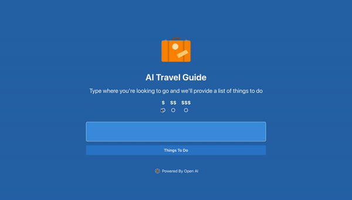
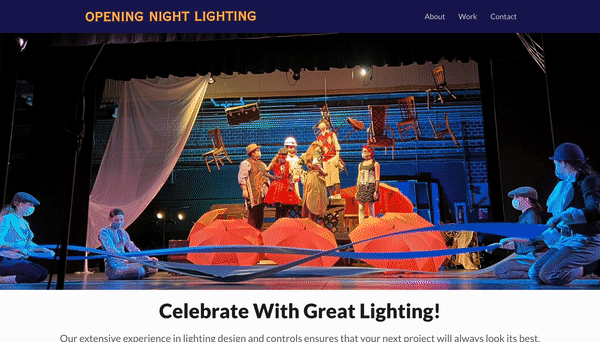
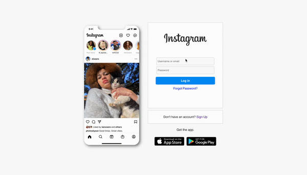
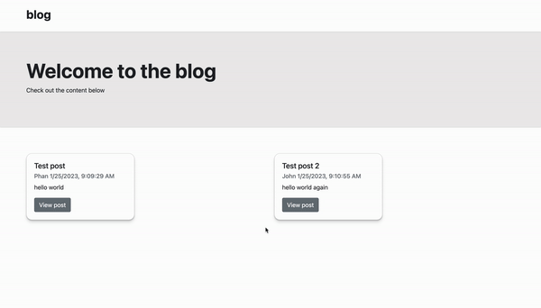
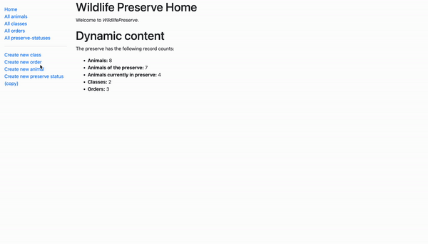

<h1 align="center">Hi 👋, I'm Owen</h1>
<h3 align="center">A full-stack software engineer from New York</h3>

- 🔭 I’m currently working on **freelance web development**

- 🌱 I’m currently learning **Dynamic Programming (Alvin the Programmer's Course)**

- 👨‍💻 See my website for more information! [owenwhitsett.com](https://owenwhitsett.com/)

- 💬 Ask me about **react, web scraping**

<h1 align="center">Projects</h1>
<table bordercolor="#66b2b2">
  
  <tr>
    <td width="50%" valign="top">
      <h3 align="center">AI Travel Guide</h3>
         
        
         
        

          
    
  
      

        
<strong>OpenAI, Javascript, React, Vite, Chakra UI & Google Maps API</strong> - AI Travel Guide powered by OpenAI. Type a location and click the button to see list of things to do along with a map.
        

    </td>
    <td width="50%" valign="top">
      <h3 align="center">Opening Night Lighting</h3>
         
      
         
        

          
  
      

        
<strong>HTML, CSS, React, TypeScript & Next.js</strong> - Designed and developed a professional website for Opening Night Lighting LLC.

    </td>
  </tr>
  
  <tr>
    <td width="50%" valign="top">
      <h3 align="center">Personal Portfolio</h3>
       
        
       
        

  
  
      

        
<strong>HTML5, CSS3 & Javascript</strong> - Portfolio Site including links to my projects and ways to get in contact with me.

    </td>
    <td width="50%" valign="top">
      <h3 align="center">Instagram Clone</h3>
         
        
         
        

          
  
  
      

        
<strong>HTML, CSS, JavaScript, React, Firebase</strong> - Clone of Instagram where users can create an account with email/password and upload images. Images are stored using Firebase Storage and displayed in React component with working like and comment system.

    </td>
  </tr>

  <tr>
    <td width="50%" valign="top">
      <h3 align="center">Blog API</h3>
       
        
       
        

  
  
      

        
<strong>HTML5, CSS3, Bootstrap, Javascript, Express, Node, MongoDB w/Mongoose</strong> - Blog to practice using an API only backend to create, read, update and delete blog posts and comments (saved using Mongoose schema to MongoDB Atlas). 

    </td>
    <td width="50%" valign="top">
      <h3 align="center">Wildlife Inventory Application</h3>
         
        
         
        

          
  
  
      

        
<strong>Express, Node, Pug Template Engine, MongoDB w/Mongoose, CSS & Bootstrap</strong> - Working inventory application of the animals, classification, order and status for a fictional wildlife preserve.

    </td>
  </tr>
</table>

<h3 align="left">Languages and Tools:</h3>

                 

